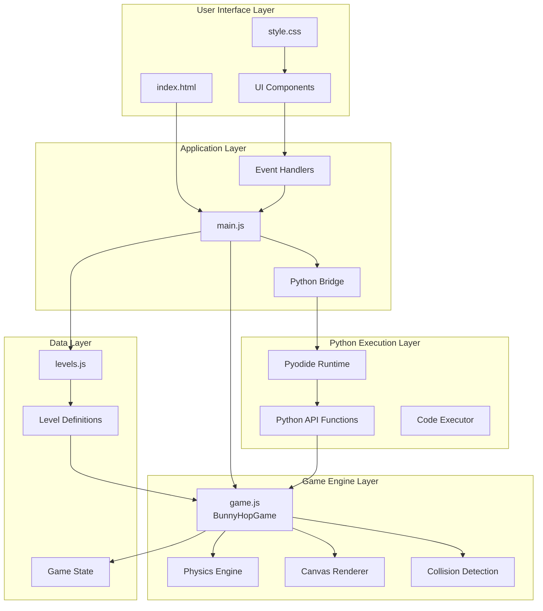

# Architecture: Client-Side Educational Game

## Overview

The Bunny Hop Coding Adventure follows a **client-side, single-page application architecture** with a clear separation between game engine, Python execution environment, and UI components. The system is designed to run entirely in the browser without requiring a server, making it accessible and easy to deploy.

## System Diagram



## Core Components

### 1. User Interface Layer

#### `index.html`
- **Purpose**: Main HTML structure and layout
- **Responsibilities**:
  - Define page structure
  - Load external dependencies (Pyodide)
  - Provide canvas element for game rendering
  - Code editor textarea
  - UI controls (buttons, selectors, stats)

#### `style.css`
- **Purpose**: Visual styling and layout
- **Responsibilities**:
  - Responsive grid layout
  - Color scheme and theming
  - Button styles and interactions
  - Canvas styling
  - Mobile-friendly responsive design

### 2. Application Layer

#### `main.js`
- **Purpose**: Application controller and orchestration
- **Responsibilities**:
  - Initialize Pyodide runtime
  - Manage game lifecycle
  - Handle user interactions
  - Coordinate between Python and game engine
  - Level loading and management
  - Code execution orchestration
  - Statistics tracking

**Key Functions**:
- `loadLevel(levelNumber)` - Load and initialize a level
- `runCode()` - Execute Python code
- `setupPythonEnvironment()` - Configure Python API
- `executePythonCode(code)` - Process and run Python code
- `processActionsWithTiming()` - Handle game animation loop

### 3. Game Engine Layer

#### `game.js` - `BunnyHopGame` Class
- **Purpose**: Core game engine and physics simulation
- **Responsibilities**:
  - Game state management
  - Physics simulation (gravity, velocity, collision)
  - Rendering all game elements
  - Collision detection
  - Level loading and initialization
  - Moving platform logic
  - Collectible tracking

**Key Properties**:
- `bunny` - Player character state (position, velocity, onGround, etc.)
- `platforms` - Static platforms array
- `movingPlatforms` - Dynamic platforms with movement logic
- `carrots`, `stars`, `coins` - Collectible items
- `obstacles` - Hazard objects
- `goal` - Level completion target
- `gameState` - Persistent game state for reset/replay

**Key Methods**:
- `loadLevel(levelData)` - Initialize level from data
- `update()` - Physics and game logic update
- `draw()` - Render all game elements
- `checkCollisions()` - Handle all collision detection
- `moveRight(steps)`, `moveLeft(steps)`, `jump()` - Player movement API
- `collect()` - Collect nearby items
- `start()`, `stop()`, `reset()` - Game lifecycle control

**Rendering Methods**:
- `drawBunny()` - Render player character with detailed sprite
- `drawPlatforms()` - Render static and moving platforms
- `drawCarrots()`, `drawStars()`, `drawCoins()` - Render collectibles
- `drawObstacles()` - Render hazards
- `drawGoal()` - Render level completion flag

### 4. Python Execution Layer

#### Pyodide Integration
- **Purpose**: Execute Python code in the browser
- **Technology**: Pyodide v0.24.1 (via CDN)
- **Responsibilities**:
  - Load Python runtime
  - Execute user Python code
  - Bridge Python functions to JavaScript game engine
  - Handle async operations (wait/sleep)

#### Python API Functions
Exposed to user code:
- `move_right(steps)` - Move bunny right
- `move_left(steps)` - Move bunny left
- `jump()` - Make bunny jump
- `wait(seconds)` - Wait for specified time
- `sleep(milliseconds)` - Sleep for milliseconds
- `collect()` - Collect nearby items
- `get_position()` - Get bunny's (x, y) position
- `get_carrot_count()` - Get collected items count
- `is_on_ground()` - Check if bunny is on ground
- `can_jump()` - Check if bunny can jump

### 5. Data Layer

#### `levels.js`
- **Purpose**: Level definitions and game content
- **Structure**: Object with numeric keys (1-15)
- **Level Schema**:
  ```javascript
  {
    name: string,
    instructions: string (HTML),
    startX: number,
    startY: number,
    groundY: number,
    platforms: Array<{x, y, width, height, moving?, moveSpeed?, moveRange?, moveX?, moveY?}>,
    carrots: Array<{id, x, y}>,
    stars: Array<{id, x, y}>,
    coins: Array<{id, x, y}>,
    obstacles: Array<{x, y, width, height}>,
    goal: {x, y, width, height},
    hint: string,
    startCode?: string,
    requiredCarrots?: number
  }
  ```

## Data Flow

### Code Execution Flow

```
User Input (Python Code)
    ↓
main.js: runCode()
    ↓
main.js: setupPythonEnvironment()
    ↓ (Expose game object to Python)
Pyodide: Load Python Runtime
    ↓
main.js: executePythonCode()
    ↓ (Preprocess: handle wait/sleep, comment "Try:" lines)
main.js: Split code into chunks
    ↓
For each chunk:
    ├─ If wait/sleep: await Promise
    └─ If code: pyodide.runPython()
        ↓
    Python API Functions
        ↓ (Call JavaScript)
    game.js: Movement/action methods
        ↓
    game.js: update() loop
        ↓
    game.js: draw() loop
        ↓
    Canvas: Visual update
```

### Game Loop

```
Animation Frame Request
    ↓
game.update()
    ├─ Update moving platforms
    ├─ Apply gravity
    ├─ Update bunny position
    ├─ Apply friction
    └─ checkCollisions()
        ├─ Ground collision
        ├─ Platform collision
        ├─ Collectible collision
        ├─ Obstacle collision
        └─ Goal collision
    ↓
game.draw()
    ├─ Clear canvas
    ├─ Draw background/ground
    ├─ Draw platforms
    ├─ Draw obstacles
    ├─ Draw collectibles
    ├─ Draw goal
    └─ Draw bunny
    ↓
requestAnimationFrame() (if running)
```

## Design Patterns

### 1. Game Loop Pattern
- Continuous update/render cycle
- Frame-based animation (60fps target)
- State management between frames

### 2. Component Separation
- Clear separation of concerns:
  - UI (HTML/CSS)
  - Application logic (main.js)
  - Game engine (game.js)
  - Data (levels.js)

### 3. API Bridge Pattern
- Python-to-JavaScript bridge via Pyodide
- Exposed game methods as Python functions
- Async handling for timing operations

### 4. State Management
- Game state object for persistence
- Reset capability via state snapshot
- Level-specific state initialization

### 5. Event-Driven Architecture
- User interactions trigger events
- Event handlers coordinate actions
- Async code execution with promises

## Technology Stack

### Core Technologies
- **HTML5**: Structure and semantic markup
- **CSS3**: Styling and responsive layout
- **JavaScript (ES6+)**: Application logic
- **Canvas API**: 2D game rendering
- **Pyodide**: Python runtime in browser

### External Dependencies
- **Pyodide v0.24.1** (via CDN): Python interpreter

### Browser APIs Used
- `requestAnimationFrame()`: Smooth animation
- `CanvasRenderingContext2D`: 2D drawing
- `Promise`: Async operations
- `setTimeout()`: Timing delays

## Performance Considerations

### Optimization Strategies
1. **Canvas Rendering**: Only redraw when necessary
2. **Collision Detection**: Efficient bounding box checks
3. **Code Execution**: Chunked execution for wait/sleep
4. **Memory Management**: Proper cleanup on level reset
5. **Animation**: 60fps target with requestAnimationFrame

### Limitations
- Pyodide load time (~5-10 seconds on first load)
- Large code blocks may cause execution delays
- Canvas rendering performance on low-end devices
- No persistent storage (localStorage could be added)

## Security Considerations

### Code Execution Safety
- Python code runs in isolated Pyodide environment
- No file system access
- No network access
- Limited to exposed game API functions
- No eval() or dangerous operations

### Input Validation
- Code preprocessing to handle edge cases
- Timeout protection (30 second max execution)
- Error handling and user feedback

## Extensibility

### Adding New Levels
1. Add level definition to `levels.js`
2. Follow level schema structure
3. Update level selector automatically

### Adding New Game Elements
1. Add to level data structure
2. Add rendering method in `game.js`
3. Add collision detection logic
4. Update Python API if needed

### Adding New Python Functions
1. Add JavaScript method to `BunnyHopGame` class
2. Expose via `setupPythonEnvironment()` in `main.js`
3. Document in UI help section

## Architecture Strengths

✅ **Zero Dependencies**: No build step, no npm packages  
✅ **Portable**: Single HTML file deployment  
✅ **Educational**: Clear separation helps learning  
✅ **Performant**: Efficient canvas rendering  
✅ **Extensible**: Easy to add levels and features  

## Architecture Weaknesses

⚠️ **Monolithic**: All code in single files  
⚠️ **No State Persistence**: Progress not saved  
⚠️ **Limited Error Recovery**: Errors reset game  
⚠️ **No Multiplayer**: Single-player only  
⚠️ **Browser Dependent**: Requires modern browser  

## Future Considerations

### Potential Enhancements
- LocalStorage for progress saving
- Code syntax highlighting editor
- Level editor for users
- Multiplayer support
- Achievement system
- Sound effects and music
- Mobile touch controls
- Code sharing/export

---

*Last Updated*: 2025-01-30  
*Version*: 1.0

